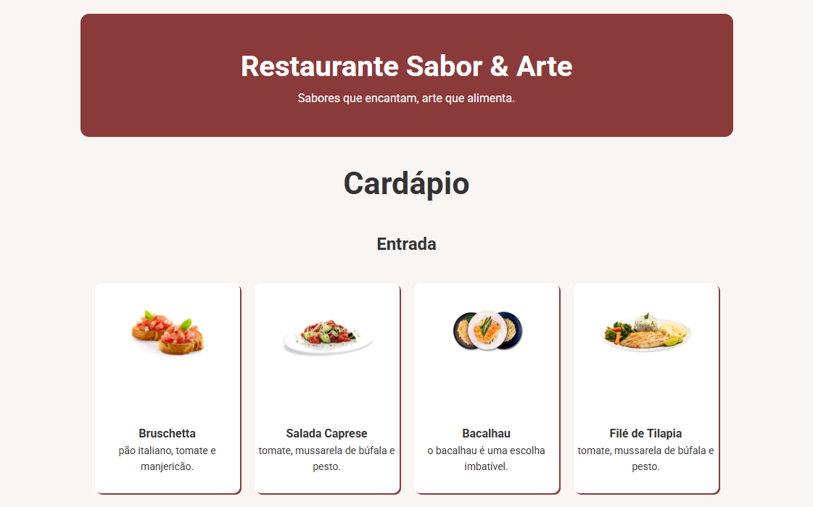
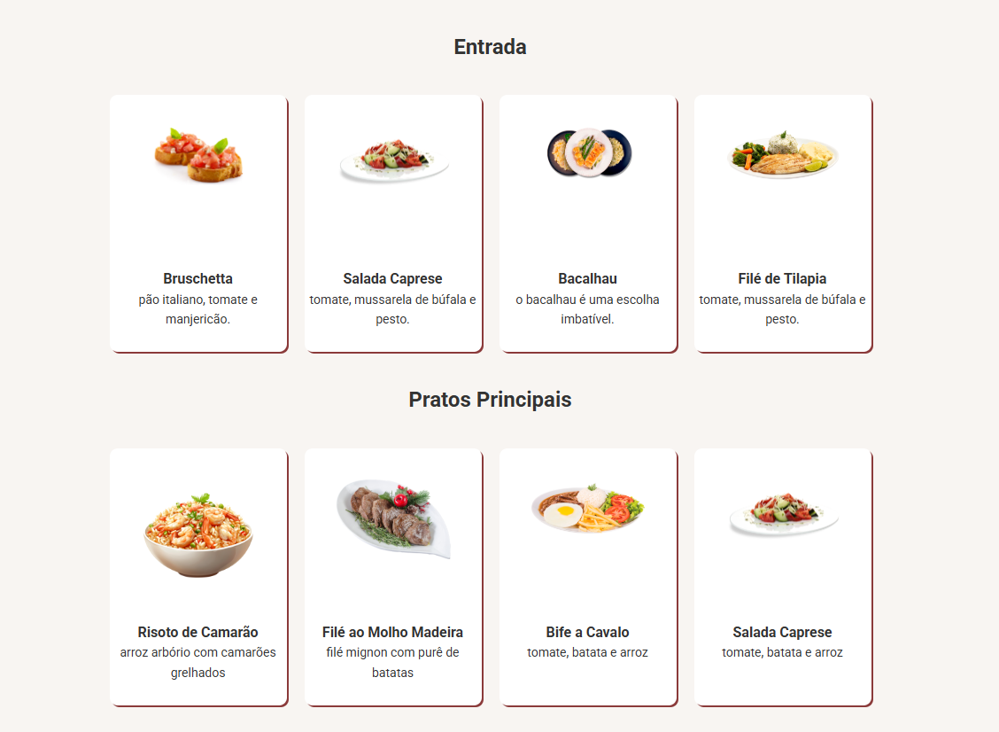
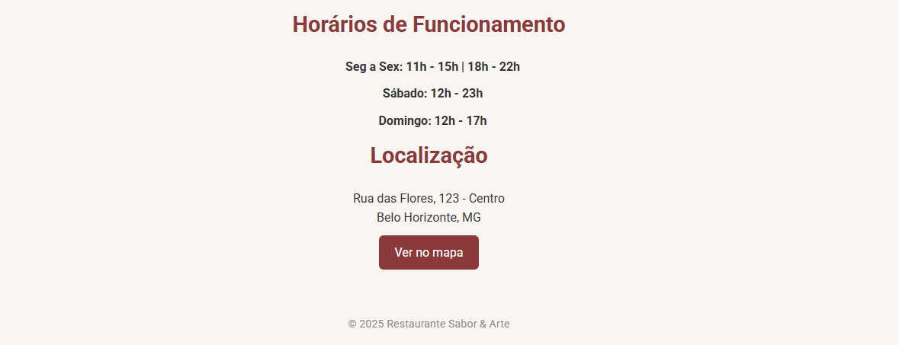

# Atividade do Curso Técnico de Desenvovimento de Sistemas
## Módulo HTML e CSS
### Exercício 3

## Orientações
1. usar o reset
2. usar o root
3. Tipo de Fonte externa Roboto

## Root
### Body
background-color: #f8f5f2;
color: #333;

### Header
background-color: #8b3a3a;
color: #fff;

### Categoria
background-color: white;

### Botão Mapa
background-color: #a14444;
color: #fff;

### Botão Mapa Hover
background-color: #a14444;

## Conteúdo
### Main
width: 900px;

### Categoria
box-shadow: 2px 2px #8b3a3a;

### Botão Mapa
transition: background 0.3s ease;

## Média Querie
@media (max-width: 600px) {
    body {
        padding: 10px;
    }

    h1 {
        font-size: 2rem;
    }

    .botao-mapa {
        width: 100%;
        text-align: center;
    }
}

## Template

 

 

